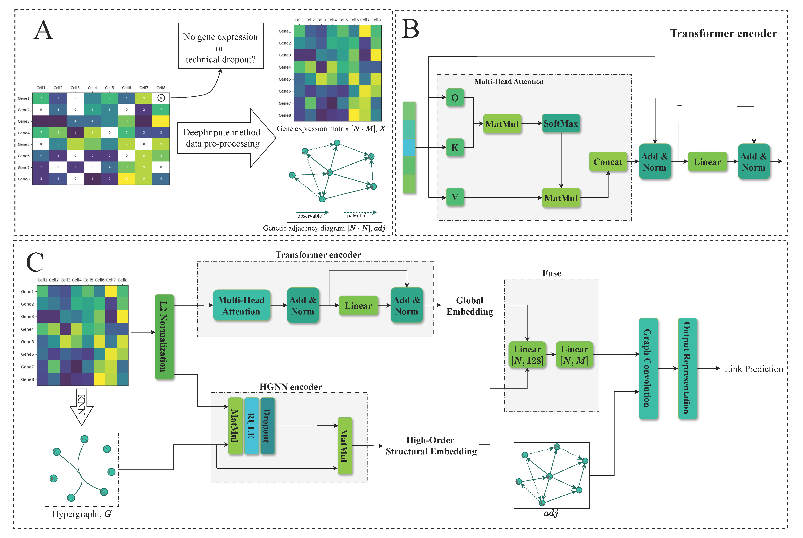

## TransHGCN: Inferring Gene Regulatory Networks from Single-Cell RNA-seq by Combining Transformer and Hypergraph
**Abstract:****[Objective]** Existing gene regulatory network (GRN) inference methods based on single-cell RNA sequencing (scRNA-seq) data often fail to capture the intricate interactions among gene features and can only model pairwise low-order relationships. To address these limitations, this paper proposes **TransHGCN**, a model that integrates Transformer and Hypergraph Convolutional Network (HGCN) architectures.**[Methods]** TransHGCN enhances performance through two core modules: (1) the Transformer module learns attention weights among gene features to accurately capture feature interaction patterns; (2) the HGCN module exploits high-order relationships among genes through hypergraph structures. The embeddings learned from these two modules are then integrated and processed through a Graph Convolutional Network (GCN) with dot product operations to output prediction probabilities, thereby achieving network link inference and completion.**[Results]** Experiments on seven types of scRNA-seq datasets demonstrate that TransHGCN achieves superior performance compared with two strong baseline models, **GNNLink** and **GENELink**. Specifically, under the TFs+500 and TFs+1000 gene settings, TransHGCN improves AUROC by 3.15% and 8.57%, and AUPRC by 9.81% and 24.43%, respectively.**[Limitations]** The model’s transferability and interpretability across species and platforms remain to be further validated.**[Conclusion]** TransHGCN provides an efficient and robust solution for GRN inference from scRNA-seq data, offering a scalable framework for modeling complex biological networks.  
**Keywords:** single-cell RNA sequencing (scRNA-seq); gene regulatory network (GRN); Transformer; hypergraph convolutional network (HGCN); graph convolutional network (GCN)

## Dependencies

- Python == 3.10 
- Pytorch == 2.8.0+cu126
- scikit-learn==1.7.2
- numpy==2.1.2
- pandas=2.3.2
- scipy==1.15.3

## Dataset:  
### Table | Statistical data of single-cell transcriptomics dataset and 4 networks consisting of TFs and 500 (1000) most variable genes

**STRING & Non-specific CHIP-seq**

|cell type   | cells | TFs (STRING) | Genes (STRING) | Density (STRING) | TFs (CHIP-seq) | Genes (CHIP-seq) | Density (CHIP-seq) |
|------------|----------|--------------|----------------|------------------|----------------|------------------|---------------------|
| hESC       | 759      | 343 (351)    | 511 (695)      | 0.024 (0.021)    | 283 (292)      | 753 (1138)       | 0.016 (0.014)       |
| hHEP       | 426      | 409 (414)    | 646 (874)      | 0.028 (0.024)    | 322 (332)      | 825 (1217)       | 0.015 (0.013)       |
| mDC        | 384      | 264 (273)    | 479 (664)      | 0.038 (0.032)    | 250 (254)      | 634 (969)        | 0.019 (0.016)       |
| mESC       | 422      | 495 (499)    | 638 (785)      | 0.024 (0.021)    | 516 (522)      | 890 (1214)       | 0.015 (0.013)       |
| mHSC-E     | 1072     | 156 (161)    | 291 (413)      | 0.029 (0.027)    | 144 (147)      | 442 (674)        | 0.017 (0.013)       |
| mHSC-GM    | 890      | 92 (100)     | 201 (344)      | 0.040 (0.037)    | 82 (88)        | 297 (526)        | 0.030 (0.029)       |
| mHSC-L     | 848      | 39 (40)      | 70 (81)        | 0.048 (0.045)    | 35 (37)        | 164 (192)        | 0.048 (0.043)       |

---

**Cell-type-specific ChIP-seq & LOF/GOF**

|cell type   | cells | TFs (ChIP-seq) | Genes (ChIP-seq) | Density (ChIP-seq) | TFs (LOF/GOF) | Genes (LOF/GOF) | Density (LOF/GOF) |
|------------|----------|----------------|------------------|---------------------|----------------|-----------------|-------------------|
| hESC       | 759      | 34 (34)        | 815 (1260)       | 0.164 (0.165)       | -              | -               | -                 |
| hHEP       | 426      | 30 (31)        | 874 (1331)       | 0.379 (0.377)       | -              | -               | -                 |
| mDC        | 384      | 20 (21)        | 443 (684)        | 0.085 (0.082)       | -              | -               | -                 |
| mESC       | 422      | 88 (89)        | 977 (1385)       | 0.345 (0.347)       | 34 (34)        | 774 (1098)      | 0.158 (0.154)     |
| mHSC-E     | 1072     | 29 (33)        | 691 (1177)       | 0.578 (0.566)       | -              | -               | -                 |
| mHSC-GM    | 890      | 22 (23)        | 618 (1089)       | 0.543 (0.565)       | -              | -               | -                 |
| mHSC-L     | 848      | 16 (16)        | 525 (640)        | 0.525 (0.507)       | -              | -               | -                 |

[DOWNLOAD](https://drive.google.com/file/d/1tthOy2v-GfVBlR9xUdyqZVBqqvOgnZlX/view?usp=drive_link)
